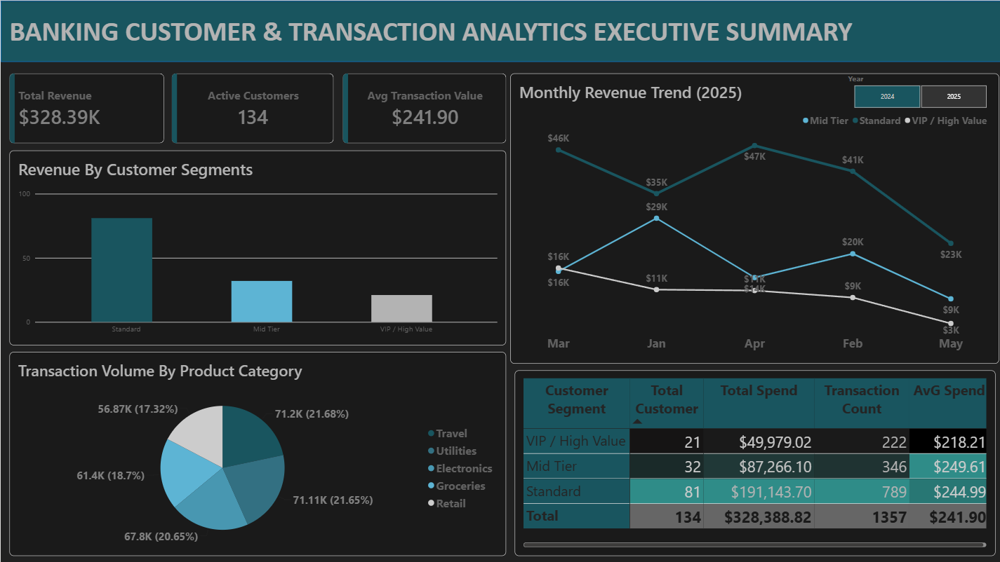

# 💳 Banking Customer & Transaction Analytics Solution

An enterprise-grade analytical solution built to decode transactional datasets, uncover customer behavioral patterns, and track high-value segments using cloud-based data warehouses and advanced business intelligence.

---

## 🚀 Project Overview & Objectives
* **Objective:** Analyze transactional datasets and customer behaviors to identify spending trends, high-value segments, and customer engagement metrics.
* **Business Impact:** Empowers stakeholders with deep visibility into customer activity, revenue generation, and product usage, driving targeted retention and growth strategies.

---

## 🛠️ Technical Implementation & Tech Stack
* **Core Tech Stack:** `SQL`, `Python`, `Power BI`, `Excel`, `GCP`

1. **Data Engineering & Warehousing (GCP & SQL):**
   * Engineered complex analytical datasets utilizing Google Cloud Platform (GCP) environments.
   * Leveraged advanced SQL (complex joins, CTEs, aggregations, subqueries, and window functions) to structure and transform raw transaction and customer tables.

2. **Data Wrangling & Statistical Analysis (Python & Excel):**
   * Utilized Python (`pandas`, `numpy`) for thorough data cleaning, exploratory data analysis (EDA), trend analysis, and anomaly identification.
   * Executed rigorous source-to-report reconciliation and data-quality checks.
   * Leveraged Excel for initial data profiling and rapid validation.

3. **Business Intelligence & Executive Visualization (Power BI):**
   * Designed and built interactive Power BI dashboards tracking transaction volume, customer activity, revenue generation, and product usage metrics.
   * Configured dynamic KPIs and cross-filtering capabilities for stakeholder-ready insights.


---

## 📂 Repository Structure
```text
├── sql/
│   └── customer_transaction_aggregations.sql  # Core GCP BigQuery SQL scripts
├── python/
│   └── customer_segmentation_eda.ipynb        # Google Colab EDA, anomaly detection & data pipeline
├── dashboard/
│   └── banking_transaction_dashboard.pbix     # Power BI Interactive Dashboard file
└── assets/
    └── dashboard_preview.png                  # Visual preview screenshot
